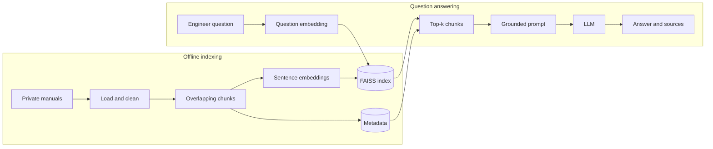

# Technical Documentation RAG Prototype

A small, explainable retrieval-augmented generation (RAG) system for searching private technical documents and returning answers grounded in retrieved source passages.

The prototype demonstrates the exact stack named in the CV:

- embeddings generated locally with Sentence Transformers;
- FAISS cosine-similarity search;
- a FastAPI backend and simple browser interface;
- optional grounded answer generation through the OpenAI Responses API;
- Docker packaging and an AWS deployment pattern;
- visible source passages so an engineer can verify the answer.

The sample turbine documents are fictional and are not operating instructions.

## Architecture



The central idea is that the LLM is not asked to answer from memory. It receives only the engineer's question and the few document chunks retrieved by FAISS. The prompt explicitly requires citations and an “I could not find that” response when the context is insufficient.

## What happens during indexing

1. The loader reads `.txt`, `.md`, or `.pdf` files. PDF text is extracted page by page so page citations can be retained.
2. Text is cleaned and split into 180-word chunks with a 30-word overlap. The overlap reduces the risk of losing meaning at a chunk boundary.
3. `all-MiniLM-L6-v2` converts every chunk into a 384-dimensional semantic vector.
4. The vectors are normalised and stored in `FAISS IndexFlatIP`. Inner product between normalised vectors is cosine similarity.
5. The original text, filename, page, and chunk number are stored separately in `data/chunks.json`.

## What happens when a user asks a question

1. The same embedding model converts the question to a vector.
2. FAISS returns the `top_k` closest chunk vectors.
3. The service reconstructs the associated source text from the metadata.
4. The question and numbered source passages are assembled into a constrained prompt.
5. If `OPENAI_API_KEY` is configured, the LLM synthesises a concise answer with `[1]`, `[2]` citations. Without a key, the prototype still works in retrieval-only mode and shows the evidence.

## Run locally

Python 3.11 is recommended.

```bash
python -m venv .venv
source .venv/bin/activate        # Windows: .venv\Scripts\activate
pip install -r requirements.txt
cp .env.example .env
uvicorn app.main:app --reload
```

Open `http://localhost:8000`. The sample documents are indexed automatically on the first run. FastAPI's interactive API documentation is available at `http://localhost:8000/docs`.

Example request:

```bash
curl -X POST http://localhost:8000/ask \
  -H "Content-Type: application/json" \
  -d '{"question":"What should be checked when bearing vibration increases?","top_k":3}'
```

To enable generated answers, set `OPENAI_API_KEY` and `OPENAI_MODEL` in `.env`. The implementation uses the official Python SDK's Responses API. The model is configurable so deployment policy can choose an approved model.

## Run with Docker

```bash
cp .env.example .env
docker compose up --build
```

The Docker volumes preserve the FAISS index and cache the embedding model between restarts.

## API endpoints

| Method | Endpoint | Purpose |
|---|---|---|
| `GET` | `/health` | Show index size, embedding backend, and generation mode |
| `POST` | `/documents/upload` | Upload and index a TXT, Markdown, or PDF document |
| `POST` | `/ask` | Retrieve relevant chunks and generate a grounded answer |
| `GET` | `/docs` | Open the automatically generated FastAPI API interface |

## AWS deployment framework

For a small prototype, the Docker container can run on an EC2 instance. A stronger production design is:

- store private source documents in an encrypted S3 bucket;
- build the Docker image and push it to Amazon ECR;
- run the API on ECS/Fargate inside a private VPC;
- place an Application Load Balancer in front of the service;
- store API keys in AWS Secrets Manager rather than the image or source code;
- write application and audit logs to CloudWatch;
- persist the FAISS index on EFS or rebuild it from versioned S3 documents;
- add authentication and document-level access control before allowing retrieval.

For confidential engineering data, a key design decision is whether document text may be sent to an external LLM. This prototype creates embeddings locally. In production, an approved private model endpoint or an organisation-approved managed service should be used, and the retrieved context should be filtered by the user's permissions.

## Testing

Core unit tests do not download a model or require FAISS:

```bash
python -m unittest discover -s tests -v
python scripts/smoke_demo.py
```

The smoke demo uses the dependency-free hashing embedder and in-memory vector store only to verify the pipeline. The actual application uses Sentence Transformers and FAISS.

## Limitations and sensible next steps

- Scanned PDFs need OCR; `pypdf` only extracts embedded text.
- `IndexFlatIP` performs exact search and is suitable for a modest document collection. A large corpus may require a FAISS IVF or HNSW index.
- The current chunker is word-based. A production version should compare token-aware, heading-aware, and semantic chunking.
- Relevance should be evaluated with a labelled set of representative engineering questions using recall@k, MRR, answer faithfulness, and citation accuracy.
- Production ingestion should detect document updates, remove stale chunks, preserve versions, and prevent duplicates.
- Upload and query endpoints need authentication, authorisation, malware scanning, encryption, rate limits, and audit logging.

## Repository map

```text
app/main.py              FastAPI endpoints and startup lifecycle
app/document_loader.py   TXT, Markdown, and PDF loading
app/chunking.py          Cleaning, overlap, and chunk metadata
app/embeddings.py        Sentence Transformer and test fallback
app/vector_store.py      FAISS persistence and cosine retrieval
app/generation.py        Grounding prompt and optional LLM call
app/service.py           End-to-end RAG orchestration
docs/                    Fictional sample technical documents
tests/                   Unit tests for chunking and retrieval
architecture.mmd         Standalone Mermaid diagram source
INTERVIEW_GUIDE.md       Presentation and interview explanation
```

